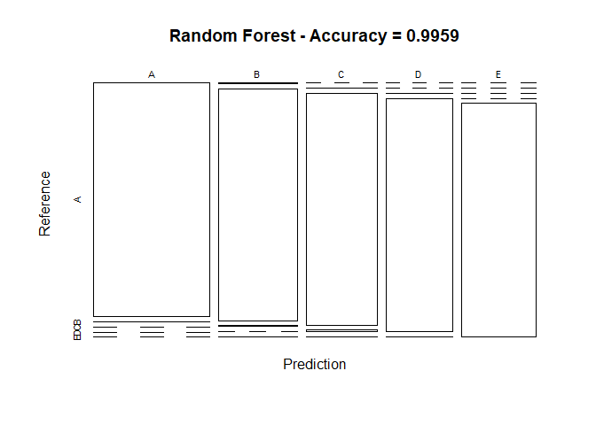

## Overview

Using devices such as Jawbone Up, Nike FuelBand, and Fitbit it is now possible to collect a large amount of data about personal activity relatively inexpensively. These type of devices are part of the quantified self movement – a group of enthusiasts who take measurements about themselves regularly to improve their health, to find patterns in their behavior, or because they are tech geeks. One thing that people regularly do is quantify how much of a particular activity they do, but they rarely quantify how well they do it. In this project, your goal will be to use data from accelerometers on the belt, forearm, arm, and dumbell of 6 participants. They were asked to perform barbell lifts correctly and incorrectly in 5 different ways.


## Loading and preprocessing the data


```r
rfilename <- "pml-training.csv"


# Checking if folder exists
if (!file.exists(rfilename)) { 
  fileURL <- "https://d396qusza40orc.cloudfront.net/predmachlearn/pml-training.csv"
  download.file(fileURL, rfilename)
  rfilename <- "pml-testing.csv"
  fileURL <- "https://d396qusza40orc.cloudfront.net/predmachlearn/pml-testing.csv"
  download.file(fileURL, rfilename)
}

trainingraw <- read.csv(file="pml-training.csv", header=TRUE)
testingraw <- read.csv(file="pml-testing.csv", header=TRUE)

# now we set Classe column as a factor variable
trainingraw$classe <- as.factor(trainingraw$classe)

# Now we remove the columns with missing values and the first 7 columns which
# no have a significant value


trainData<- trainingraw[, colSums(is.na(trainingraw)) == 0]
testingData <- testingraw[, colSums(is.na(testingraw)) == 0]
trainData <- trainData[, -c(1:7)]
testingData <- testingData[, -c(1:7)]

#Now we check the new size of our data
dim(trainData)
```

```
## [1] 19622    86
```

### Preparing Data for prediction

```r
set.seed(202012) 
inTrain <- createDataPartition(trainData$classe, p = 0.7, list = FALSE)
testData <- trainData[-inTrain, ]
trainData <- trainData[inTrain, ]
#Now we check the new size of our data
dim(trainData)
```

```
## [1] 13737    86
```

### removing the variables that are near-zero-variance

```r
NZV <- nearZeroVar(trainData)
trainData <- trainData[, -NZV]
testData  <- testData[, -NZV]
#Now we check the final size of our data
dim(trainData)
```

```
## [1] 13737    53
```
Finally we have reduce our number of variables from 160 to 53

## Prediction Model Building

Three methods will be applied to model the regressions  and the best one with higher accuracy when applied to the Test dataset, will be used for the quiz predictions. The methods are: Generalized Boosted Model, Random Forests and Decision Tree.
A Confusion Matrix is plotted at the end of each analysis to better visualize the accuracy of the models.

### First model to use: Generalized Boosted Model

```r
set.seed(202012)
controlGBM <- trainControl(method = "repeatedcv", number = 5, repeats = 1)
modFitGBM  <- train(classe ~ ., data=trainData, method = "gbm",
                    trControl = controlGBM, verbose = FALSE)
modFitGBM$finalModel
```

```
## A gradient boosted model with multinomial loss function.
## 150 iterations were performed.
## There were 52 predictors of which 52 had non-zero influence.
```

```r
print(modFitGBM)
```

```
## Stochastic Gradient Boosting 
## 
## 13737 samples
##    52 predictor
##     5 classes: 'A', 'B', 'C', 'D', 'E' 
## 
## No pre-processing
## Resampling: Cross-Validated (5 fold, repeated 1 times) 
## Summary of sample sizes: 10990, 10989, 10989, 10990, 10990 
## Resampling results across tuning parameters:
## 
##   interaction.depth  n.trees  Accuracy   Kappa    
##   1                   50      0.7519833  0.6856231
##   1                  100      0.8186649  0.7704236
##   1                  150      0.8512052  0.8116811
##   2                   50      0.8552080  0.8165607
##   2                  100      0.9068210  0.8820787
##   2                  150      0.9308437  0.9125039
##   3                   50      0.8962656  0.8686501
##   3                  100      0.9417636  0.9263111
##   3                  150      0.9588705  0.9479673
## 
## Tuning parameter 'shrinkage' was held constant at a value of 0.1
## 
## Tuning parameter 'n.minobsinnode' was held constant at a value of 10
## Accuracy was used to select the optimal model using the largest value.
## The final values used for the model were n.trees = 150, interaction.depth =
##  3, shrinkage = 0.1 and n.minobsinnode = 10.
```

```r
# Validate the GBM model
predictGBM <- predict(modFitGBM, newdata=testData)
cmGBM <- confusionMatrix(predictGBM, testData$classe)
cmGBM
```

```
## Confusion Matrix and Statistics
## 
##           Reference
## Prediction    A    B    C    D    E
##          A 1655   31    0    0    0
##          B   17 1071   24    4    9
##          C    1   35  991   37    3
##          D    1    2   10  916    7
##          E    0    0    1    7 1063
## 
## Overall Statistics
##                                           
##                Accuracy : 0.9679          
##                  95% CI : (0.9631, 0.9722)
##     No Information Rate : 0.2845          
##     P-Value [Acc > NIR] : < 2.2e-16       
##                                           
##                   Kappa : 0.9594          
##                                           
##  Mcnemar's Test P-Value : NA              
## 
## Statistics by Class:
## 
##                      Class: A Class: B Class: C Class: D Class: E
## Sensitivity            0.9886   0.9403   0.9659   0.9502   0.9824
## Specificity            0.9926   0.9886   0.9844   0.9959   0.9983
## Pos Pred Value         0.9816   0.9520   0.9288   0.9786   0.9925
## Neg Pred Value         0.9955   0.9857   0.9927   0.9903   0.9961
## Prevalence             0.2845   0.1935   0.1743   0.1638   0.1839
## Detection Rate         0.2812   0.1820   0.1684   0.1556   0.1806
## Detection Prevalence   0.2865   0.1912   0.1813   0.1590   0.1820
## Balanced Accuracy      0.9906   0.9645   0.9751   0.9731   0.9904
```

```r
plot(cmGBM$table, col = cmGBM$byClass, 
     main = paste("GBM - Accuracy =", round(cmGBM$overall['Accuracy'], 4)))
```

<!-- -->


### second model to use: Random Forests

```r
set.seed(202012)
controlRF <- trainControl(method="cv", number=3, verboseIter=FALSE)
modFitRandForest <- train(classe ~ ., data=trainData, method="rf",
                          trControl=controlRF)
modFitRandForest$finalModel
```

```
## 
## Call:
##  randomForest(x = x, y = y, mtry = param$mtry) 
##                Type of random forest: classification
##                      Number of trees: 500
## No. of variables tried at each split: 27
## 
##         OOB estimate of  error rate: 0.69%
## Confusion matrix:
##      A    B    C    D    E class.error
## A 3901    3    1    0    1 0.001280082
## B   21 2631    6    0    0 0.010158014
## C    0   11 2373   12    0 0.009599332
## D    0    1   24 2224    3 0.012433393
## E    0    1    3    8 2513 0.004752475
```

```r
predictRandForest <- predict(modFitRandForest, newdata=testData)
confMatRandForest <- confusionMatrix(predictRandForest, testData$classe)
confMatRandForest
```

```
## Confusion Matrix and Statistics
## 
##           Reference
## Prediction    A    B    C    D    E
##          A 1672    3    0    0    0
##          B    2 1135    5    0    2
##          C    0    1 1020    7    2
##          D    0    0    1  957    1
##          E    0    0    0    0 1077
## 
## Overall Statistics
##                                           
##                Accuracy : 0.9959          
##                  95% CI : (0.9939, 0.9974)
##     No Information Rate : 0.2845          
##     P-Value [Acc > NIR] : < 2.2e-16       
##                                           
##                   Kappa : 0.9948          
##                                           
##  Mcnemar's Test P-Value : NA              
## 
## Statistics by Class:
## 
##                      Class: A Class: B Class: C Class: D Class: E
## Sensitivity            0.9988   0.9965   0.9942   0.9927   0.9954
## Specificity            0.9993   0.9981   0.9979   0.9996   1.0000
## Pos Pred Value         0.9982   0.9921   0.9903   0.9979   1.0000
## Neg Pred Value         0.9995   0.9992   0.9988   0.9986   0.9990
## Prevalence             0.2845   0.1935   0.1743   0.1638   0.1839
## Detection Rate         0.2841   0.1929   0.1733   0.1626   0.1830
## Detection Prevalence   0.2846   0.1944   0.1750   0.1630   0.1830
## Balanced Accuracy      0.9990   0.9973   0.9960   0.9962   0.9977
```

```r
plot(confMatRandForest$table, col = confMatRandForest$byClass, 
     main = paste("Random Forest - Accuracy =", round(confMatRandForest$overall['Accuracy'], 4)))
```

<!-- -->


### Last model to use: Decision Trees

```r
set.seed(202012)
decisionTreeMod1 <- rpart(classe ~ ., data=trainData, method="class")
fancyRpartPlot(decisionTreeMod1, sub = "Rattle 2020-12-27 23:41:00 WernerGarcia")
```

```
## Warning: labs do not fit even at cex 0.15, there may be some overplotting
```

<!-- -->

```r
predictTreeMod1 <- predict(decisionTreeMod1, testData, type = "class")
cmtree <- confusionMatrix(predictTreeMod1, testData$classe)
cmtree
```

```
## Confusion Matrix and Statistics
## 
##           Reference
## Prediction    A    B    C    D    E
##          A 1509  189   11   58   16
##          B   59  722  121   85   99
##          C   34   96  771   80   73
##          D   58   77   83  668   85
##          E   14   55   40   73  809
## 
## Overall Statistics
##                                         
##                Accuracy : 0.7611        
##                  95% CI : (0.75, 0.7719)
##     No Information Rate : 0.2845        
##     P-Value [Acc > NIR] : < 2.2e-16     
##                                         
##                   Kappa : 0.6972        
##                                         
##  Mcnemar's Test P-Value : < 2.2e-16     
## 
## Statistics by Class:
## 
##                      Class: A Class: B Class: C Class: D Class: E
## Sensitivity            0.9014   0.6339   0.7515   0.6929   0.7477
## Specificity            0.9349   0.9233   0.9418   0.9384   0.9621
## Pos Pred Value         0.8463   0.6648   0.7315   0.6880   0.8163
## Neg Pred Value         0.9598   0.9131   0.9472   0.9398   0.9442
## Prevalence             0.2845   0.1935   0.1743   0.1638   0.1839
## Detection Rate         0.2564   0.1227   0.1310   0.1135   0.1375
## Detection Prevalence   0.3030   0.1845   0.1791   0.1650   0.1684
## Balanced Accuracy      0.9182   0.7786   0.8466   0.8157   0.8549
```

```r
plot(cmtree$table, col = cmtree$byClass, 
     main = paste("Decision Tree - Accuracy =", round(cmtree$overall['Accuracy'], 4)))
```

<!-- -->

## Applying the Best Model to the Test Data

The accuracy of the 3 regression modeling methods above are:

    Random Forest : 0.9959
    Decision Tree : 0.7611
    GBM : 0.9679

In that case, the Random Forest model will be applied to predict the 20 quiz results as now we show.


```r
finalpredict <- predict(modFitRandForest, newdata=testingData)
finalpredict
```

```
##  [1] B A B A A E D B A A B C B A E E A B B B
## Levels: A B C D E
```
